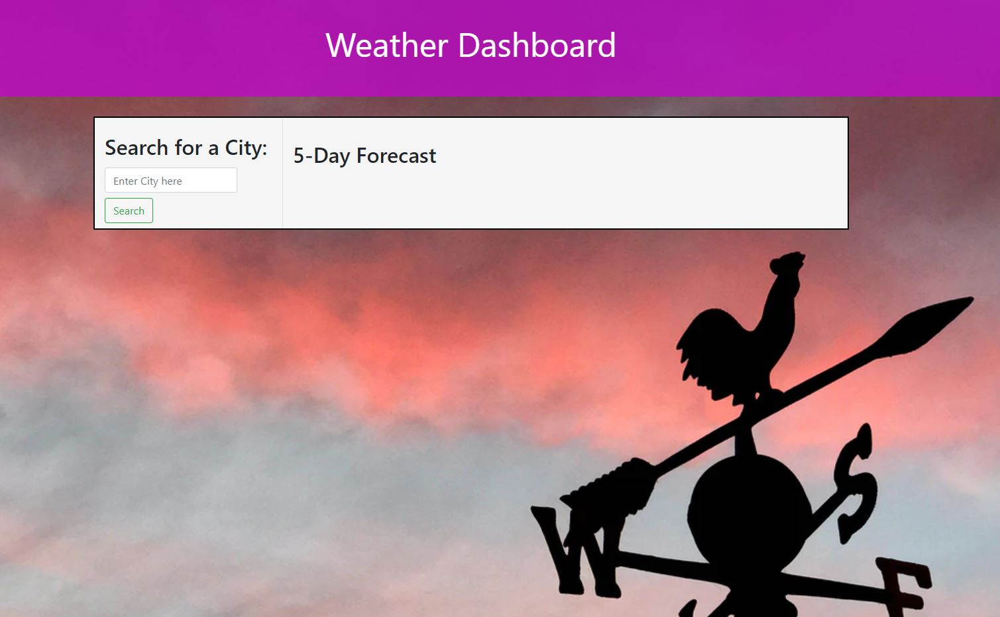
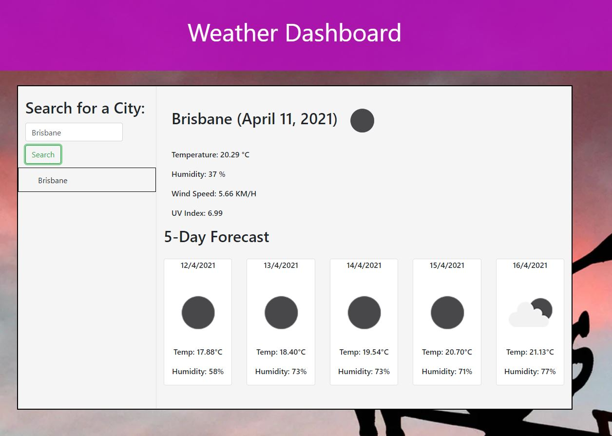
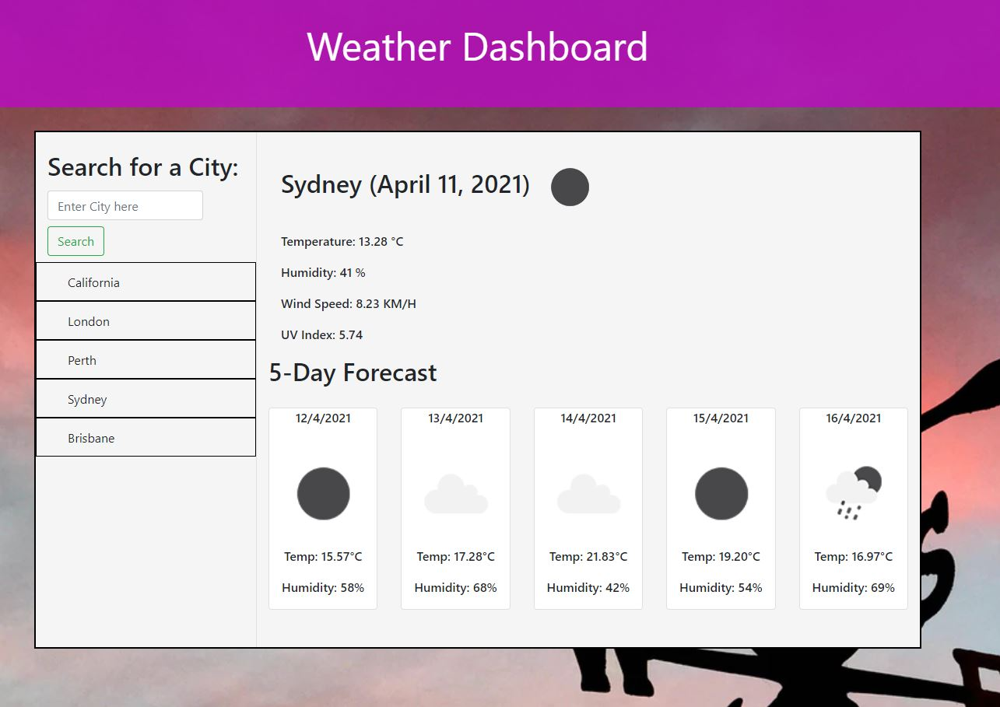

# Weather Dashboard

## About

This weather dashboard was designed to give you today's weather forecast as well as a 5-day weather forecast for a chosen location. Search for your location and you will be notified of the temperature, wind speed, UV index and humidity for the current date, whereas the 5-day forecast will display the temperature and humidity.

## Functionality

Upon opening the [Weather Dashboard](https://bdjm94.github.io/06-weather-dashboard/), you are displayed with a nice background of a weather vane and the title. It will also show a search box asking you to "search for a city". There will be a "5-Day Forecast" being shown, but no other data will be displayed. Upon searching for a city, it will bring up that city, along with the current date and weather forecast, as well as a 5-day weather forecast for that city. Your searches will be saved so you can quickly switch between previously searched cities to get their weather forecast.

## Weather Dashboard in Use

Main page when you first load up the weather dashboard:

Displaying the weather of a searched city:

Displaying the results of previous searches that can be clicked through for quick access:

Below shows the weather dashboard in use. Shows the search of a city and then the ability to click through previous searches to display their weather forecast:

## Credits

- [Moment.js](https://momentjs.com/)
- [Weather API](https://openweathermap.org/api)
- [Bootstrap](https://getbootstrap.com/docs/5.0/customize/overview/)
- [jQuery](https://api.jquery.com/)
